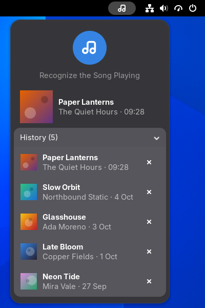

# Song Recognizer

Recognize the song your computer is playing, from the top bar or quick settings, with SongRec.



## What it does

- **One click**: press the round button and it listens to what your computer is playing for
  a few seconds, then shows the song and its cover.
- **History**: every song it finds is kept under the button. Remove one with its ×.
- **Top bar or quick settings**: keep it in the top bar, or as a round button beside the
  screenshot button in quick settings. There it stays lit while it listens, and the song
  comes as a notification.
- **Your choice of source**: the computer's own sound, or the microphone.


## Requirements

- GNOME Shell 50, on PipeWire (most distributions use it by default).
- [SongRec](https://github.com/marin-m/SongRec), which does the recognition. Install your
  distribution's package, not the Flatpak, which does not provide the `songrec` command.

## Install

1. Install SongRec, for example on Arch Linux:

   ```bash
   sudo pacman -S songrec
   ```

   Other distributions: see [SongRec's install instructions](https://github.com/marin-m/SongRec#installation).

2. Install the extension:

   ```bash
   git clone https://github.com/Jackicus/GNOME-Song-Recognizer.git
   cd GNOME-Song-Recognizer
   make install
   ```

3. Log out and back in. GNOME only finds a new extension when you log in.

4. Turn it on:

   ```bash
   gnome-extensions enable song-recognizer@jackicus
   ```

   A note icon appears in the top bar. Play some music, click the icon, then the round button.

To update: `git pull && make install`, then log out and back in. To remove: `make uninstall`.

## Preferences

Open them with `gnome-extensions prefs song-recognizer@jackicus`, or from the Extensions app.

- **Location**: the top bar, with the history in its menu, or quick settings.
- **Use the Microphone**: listen through the microphone instead of the computer's sound.
- **Listening Time**: how many seconds it records, 10 by default.
- **Clicking a Song**: open its Shazam page, or copy its title and artist.
- **Notify**: show the song in a notification when the menu is closed. In quick settings
  it always does.
- **Songs Kept** and **Clear History**.

## Privacy and network

Nothing is recorded until you press the button. Then it records a few seconds into a
temporary file and runs SongRec on it, which sends a fingerprint of the sound to Shazam's
servers. The file is deleted straight after. Covers are loaded from Apple's image servers.
The history stays on your computer, in the extension's settings. Clicking a song opens its
Shazam page in your browser or, if you choose, copies its title and artist to the clipboard.

This extension is not affiliated with Shazam or Apple. SongRec is an unofficial client.

## Troubleshooting

- **"SongRec Is Missing"**: the `songrec` command isn't installed. Install it as above, then
  log out and back in.
- **"No Match"**: make sure the music is playing out loud on this computer, or turn on
  **Use the Microphone** for sound from another device. A longer **Listening Time** helps
  with quiet or busy recordings.

The extension's messages are in the journal. Include them in a bug report:

```bash
journalctl -f -o cat /usr/bin/gnome-shell | grep -i 'song recognizer'
```

## Development

See [CONTRIBUTING.md](CONTRIBUTING.md). `make link` runs it from the clone, `make check`
lints it, and `./scripts/nested.sh shots` retakes the screenshots. `docs/` covers the
private shell API the quick settings button uses and the extensions.gnome.org review.

## Licence

GPL-2.0-or-later. See [LICENSE](LICENSE).

The songs and covers in the screenshots are invented.
