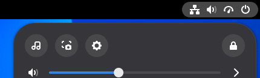

# SongRec Button

A quick settings button that runs [SongRec](https://github.com/marin-m/SongRec) to recognize
the song your computer is playing.



## What it does

- **One click**: click the SongRec pill in quick settings and it listens to what your
  computer is playing for a few seconds. It stays lit while it listens, and a notification
  says what it found.
- **History**: open the pill's menu with its arrow to see every song it has found. Remove
  one with its ×.
- **SongRec's own settings**: the audio input (your computer's sound by default, or any
  output or microphone), notifications, no duplicates, and a search link.

## Requirements

- GNOME Shell 50, on PipeWire (most distributions use it by default).
- [SongRec](https://github.com/marin-m/SongRec), which does the recognition. Install your
  distribution's package, not the Flatpak, which does not provide the `songrec` command.

## Install

1. Install SongRec, for example on Arch Linux:

   ```bash
   sudo pacman -S songrec
   ```

   Other distributions: see [SongRec's install instructions](https://github.com/marin-m/SongRec#installation).

2. Install the extension:

   ```bash
   git clone https://github.com/Jackicus/GNOME-SongRec-Button.git
   cd GNOME-SongRec-Button
   make install
   ```

3. Log out and back in. GNOME only finds a new extension when you log in.

4. Turn it on:

   ```bash
   gnome-extensions enable songrec-button@jackicus
   ```

   A SongRec pill appears in quick settings. Play some music, then click it.

To update: `git pull && make install`, then log out and back in. To remove: `make uninstall`.

## Preferences

Open them with `gnome-extensions prefs songrec-button@jackicus`, or from the Extensions app.

- **Audio Input**: what it listens to. **Computer Sound** (the default) is whatever your
  computer is playing; **Microphone** is your default microphone; or pick any output or input.
- **Listening Time**: how many seconds it records, 10 by default.
- **Notifications**: say what was found in a notification.
- **Clicking a Song**: open its Shazam page (or search for it, when Shazam gave none),
  search for it with the **Search Link** (YouTube by default, as in SongRec), or copy its
  title and artist.
- **No Duplicates**: a song found again moves to the top of the history instead of being
  added twice.
- **Songs Kept** and **Clear History**.

## Privacy and network

Nothing is recorded until you press the button. Then it records a few seconds into a
temporary file and runs SongRec on it, which sends a fingerprint of the sound to Shazam's
servers. The file is deleted straight after. Covers are loaded from Apple's image servers.
The history stays on your computer, in the extension's settings. Clicking a song opens its
Shazam page or a search for it in your browser or, if you choose, copies its title and
artist to the clipboard.

This extension is not affiliated with SongRec, Shazam or Apple. SongRec is an unofficial
Shazam client.

## Troubleshooting

- **"SongRec Is Missing"**: the `songrec` command isn't installed. Install it as above and
  click again.
- **"Recognition Failed"**: the notification says what failed. A message that starts with
  `pw-record:` means the recording itself failed: check that PipeWire is running and that
  the **Audio Input** chosen is still connected.
- **"No Match"**: make sure the music is playing on this computer, or choose **Microphone**
  as the **Audio Input** for sound from another device. With several outputs, pick the
  one the music plays through. A longer **Listening Time** helps
  with quiet or busy recordings.

The extension's messages are in the journal. Include them in a bug report:

```bash
journalctl -f -o cat /usr/bin/gnome-shell | grep -i 'songrec button'
```

The preferences run in a process of their own:

```bash
journalctl -f -o cat SYSLOG_IDENTIFIER=org.gnome.Shell.Extensions
```

From a clone, `make status` says whether the extension is installed and enabled, and
`make logs` shows its messages.

## Development

See [CONTRIBUTING.md](CONTRIBUTING.md). `make link` runs it from the clone, `make check`
lints it, and `./scripts/nested.sh shots` retakes the screenshots. `docs/` covers the
extensions.gnome.org review and the shell internals it relies on.

## Licence

GPL-2.0-or-later. See [LICENSE](LICENSE).

The songs and covers in the screenshots are invented.
